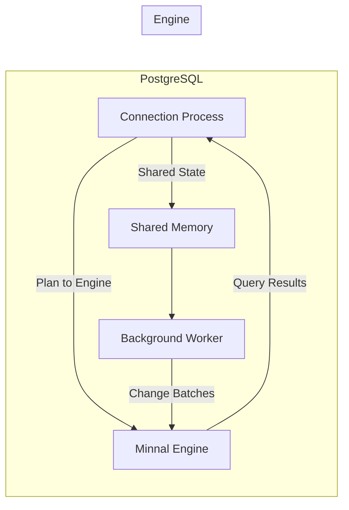

# ⚡ Minnal — Engineering Plan v1

A combined and reflowed plan that unifies product/UX goals with a low-level, code-first implementation strategy for pg_minnal.

> Purpose: define module boundaries, public APIs, message protocols, and milestones with acceptance criteria.  
> Outcome: real-time OLAP acceleration for PostgreSQL with minimal user learning curve, delivered as a Postgres‑native subsystem.

---

## Table of Contents
- [1) Vision and Goals](#1-vision-and-goals)
- [2) Ground Truths and Constraints](#2-ground-truths-and-constraints)
- [3) UX and SQL Surface](#3-ux-and-sql-surface)
- [4) System Architecture Overview](#4-system-architecture-overview)
- [5) Extension Internals](#5-extension-internals)
- [6) Engine Internals](#6-engine-internals)
- [7) Communication and Consistency](#7-communication-and-consistency)
- [8) Configuration Model Unification](#8-configuration-model-unification)
- [9) Phased Milestones and Acceptance Criteria](#9-phased-milestones-and-acceptance-criteria)
- [10) Developer Interfaces and Protocol](#10-developer-interfaces-and-protocol)
- [11) Monitoring, Logging, and Metrics](#11-monitoring-logging-and-metrics)
- [12) Failure and Recovery UX](#12-failure-and-recovery-ux)
- [13) Risks and Mitigations](#13-risks-and-mitigations)
- [14) Appendix: Code Examples](#14-appendix-code-examples)
- [15) System Diagram](#15-system-diagram)

---

## 1) Vision and Goals
- Real-time OLAP acceleration for PostgreSQL with minimal user learning curve.
- Postgres-native experience: hide internals (engine communication, replication, recovery) behind SQL and GUCs.
- Start single-node; architect for future HA and failover.
- Default consistency: ~~up-to-LSN (queries observe changes up to a target LSN before execution)~~ (Verify if LSN alone is enough).

---

## 2) Ground Truths and Constraints
- Languages and Processes
  - Extension: C++23 as a PostgreSQL loadable module.
  - Engine: C++23, no PostgreSQL headers/symbols; clean process boundary.

- ABI and No-throw Boundary (Extension)
  - All PostgreSQL-facing entry points are `extern "C"` and `noexcept`; catch-all at the boundary.
  - No C++ exception crosses the PostgreSQL ABI boundary.
  - Wrap PG APIs that may `ereport(ERROR)` via `PG_TRY/PG_CATCH`; convert to internal errors and translate back at boundary.

- Error Model
  - Extension internals: exceptions or `std::expected`; boundary rethrows as `ereport(ERROR, ...)`.
  - Engine: prefer `std::expected<T, Status>` for recoverable errors; no exceptions across IPC or process boundaries.

- Build and Tooling
  - CMake-only; dependencies via FetchContent with pinned versions.
  - Formatting and static analysis: repository `.clang-format` and `.clang-tidy`.
  - PostgreSQL reference/build path: `/Users/hprabaka/sources/minnal/postgres/postgresql-17.6` (PG_CONFIG is mandatory).

---

## 3) UX and SQL Surface

### Configuration (GUCs)
- Core
  - `minnal.engine_host = '127.0.0.1:9000'`          # TCP endpoint
  - `minnal.change_batch_size = '1MB'`
  - `minnal.change_batch_interval = '10ms'`

- Future (HA)
  - `minnal.engine_hosts = 'minnal1:9000,minnal2:9000'`
  - `minnal.failover_policy = 'roundrobin'`

- Session overrides
  - `SET minnal.force_engine = on;`   # force offload if supported
  - `SET minnal.allow_stale = off;`   # allow serving < target LSN if policy permits

### Table Lifecycle
- Declarative, Postgres-native:
```sql
ALTER TABLE sales SET STORAGE MINNAL;
ALTER TABLE sales RESET STORAGE;
```

### Query Routing and Debugging
- Queries automatically offloaded if all referenced relations are Minnal-managed and supported.
- `EXPLAIN` shows `Custom Scan (MinnalScan)` when offloaded:
```sql
EXPLAIN SELECT * FROM sales;
```

### Monitoring (User-facing)
- Status view:
```sql
SELECT * FROM minnal.table_status;
```
Columns: `table`, `ready`, `last_wal_lsn_applied`, `replication_lag_ms`, `snapshot_size_mb`.

- Future: `pg_stat_minnal` view and Prometheus exporter.

### Transactions and Isolation
- Supported isolation (offloaded): statement-level READ COMMITTED only. Each eligible statement executes against a snapshot consistent up to a target WAL LSN.
- Transaction blocks: Offloaded execution requires single-statement (autocommit) queries. Statements inside explicit transaction blocks (START/BEGIN … COMMIT/END), even at READ COMMITTED, are not offloaded.
- Unsupported isolation (offloaded): REPEATABLE READ and SERIALIZABLE. Planner must route these to PostgreSQL (no MinnalScan).
- EXPLAIN: Non-eligible statements show standard plans (no Minnal* nodes).

---
 
## 4) System Architecture Overview
- PostgreSQL backend (extension loaded in-process)
  - Routing, planner/executor integration, configuration (GUCs), client shim.
  - Table onboarding (snapshot capture/streaming) is executed by the connection process when ALTER TABLE ... SET STORAGE MINNAL is invoked.
- Minnal engine (separate process)
  - Receives change batches pushed by the extension's bgworker, maintains columnar storage and vectorized execution, persists snapshots, and serves query execution. It does not connect to PostgreSQL directly.

---

## 5) Extension Internals

### Global State (Shared Memory)
- Table metadata: loaded state, LSN checkpoint, snapshot size.
- Background worker control: replication slot info, lag, errors, backpressure flags.

### Query Path (Connection Process)
1. Planner builds plan; eligible paths receive Minnal ~~CustomPath/CustomScan~~ (Show real execution plans with Minnal nodes (e.g., MinnalScan, MinnalJoin, Minnal*)).
2. Serialize plan (NodeToString initially, feature-gated; migrate to compact binary later).
3. Compute `target_lsn` (default `pg_current_wal_lsn()`) and include in request.
4. Send request to engine over RPC; stream results back to client.

### Table Onboarding
- Executed by the connection process during ALTER TABLE ... SET STORAGE MINNAL.
1. Take a consistent table snapshot.
2. Stream snapshot to engine.
3. Mark table `ready` in shared memory after up-to-LSN catchup.

### Background Worker
- Performs logical decoding via PostgreSQL's C API (replication slots and decoding context). Owns replication slot lifecycle and streaming of batched changes to the engine. No libpq is involved anywhere.
- Logical decoding from main thread (safe PG API usage).
- Logical decoding via replication slot, filtered to Minnal-managed tables.
- Batching: flush every `minnal.change_batch_size` or `minnal.change_batch_interval` (whichever first).
- Engine health: reconnect on restart; apply backpressure (pause slot) on lag.
- Recovery: replay snapshot + WAL to current LSN after restart.
- Metrics: update `minnal.table_status`.

---

## 6) Engine Internals

### Ingest
- Receives batched changes from the extension bgworker and applies them atomically; maintains `last_applied_lsn` per table. No libpq or direct PostgreSQL connectivity.

### Storage and Execution
- Columnar storage optimized for vectorized execution.
- Executor interprets serialized plan (MVP) or compiles to internal operators.

### RPC Server
- Exposes services to receive change batches and serve queries over configured TCP endpoints only.
- Freshness gate: wait until `last_applied_lsn ≥ target_lsn` unless stale policy allows.

---

## 7) Communication and Consistency


### Freshness and Consistency
- Default: statement-level up-to-LSN read (READ COMMITTED semantics); engine blocks until `last_applied_lsn ≥ target_lsn` or returns Deadline.
- Isolation limits: Multi-statement/transaction-block semantics are not supported by the engine; each request is independent with no cross-statement snapshot guarantee.
- Fallback: REPEATABLE READ and SERIALIZABLE execute in PostgreSQL (no Minnal offload).
- Overrides via session GUC and per-table policies.

---

## 8) Configuration Model Unification
- Configuration is TCP-only.
  - Single-node: `minnal.engine_host`.
  - HA: `minnal.engine_hosts` with `minnal.failover_policy`.
- Selection:
  1) If `engine_hosts` set, follow policy.
  2) Else if `engine_host` set, use that endpoint.
- Errors normalized via `ereport`; bgworker retries with backoff.

---

## 9) Phased Milestones and Acceptance Criteria

### Phase 1 — MVP
- UX
  - ALTER TABLE ... SET/RESET STORAGE MINNAL.
  - Automatic offload for eligible scans; EXPLAIN shows MinnalScan.
  - `minnal.table_status` view with core columns.
- Internals
  - Shared memory schema and initialization.
  - Connection processes: Plan serialization + RPC client.
    - Snapshot onboarding and streaming.
  - Bgworker: replication slot, filtering, batching, health pings.
  - Strict PG boundary adapters (`noexcept` + catch-all).
- Acceptance Criteria
  - [ ] GUCs effective (`engine_host`, batch size/interval).  
  - [ ] Onboarding marks `ready = true` after catchup; `snapshot_size_mb` populated.  
  - [ ] Offloaded queries match PG baseline; EXPLAIN shows `MinnalScan`.  
  - [ ] Freshness: default up-to-LSN; engine waits or returns Deadline.  
  - [ ] Offload eligibility: only single-statement (autocommit) READ COMMITTED; statements inside explicit transaction blocks are not offloaded.  
  - [ ] REPEATABLE READ and SERIALIZABLE cause planner fallback to PostgreSQL; EXPLAIN shows no MinnalScan.  
  - [ ] README documents isolation/transaction limitations and fallback behavior.  
  - [ ] Status view: `last_wal_lsn_applied` and `replication_lag_ms` sane/non-negative.  
  - [ ] No exception leakage across PG boundary.

### Phase 2 — Operational Features
- UX
  - HA config (`engine_hosts`, `failover_policy`).
  - Backpressure warnings in logs.
  - Extended monitoring: replication lag, active engine node, error counters.
  - `pg_stat_minnal` view integrated into pg_stat_*.
- Internals
  - Failover routing to next endpoint on errors/timeouts.
  - Recovery hooks: block queries until `ready = true` across failover.
  - Robust connection pooling and health checks.
- Acceptance Criteria
  - [ ] Transparent endpoint failover; in-flight errors normalized; new queries route to healthy engine.  
  - [ ] `pg_stat_minnal` shows node, lag, counters; consistent with engine metrics.  
  - [ ] Backpressure pauses/resumes logical slot with bounded lag.

### Phase 3 — Advanced Policies
- UX
  - Per-table freshness policies:
    ```sql
    ALTER TABLE sales SET (minnal.allow_stale = true);
    ```
  - Integration with `pg_stat_statements` for offloaded queries.
  - User-initiated refresh:
    ```sql
    SELECT minnal.refresh_table('sales');
    ```
- Internals
  - Stale query cache and enforcement in planner hook.
  - Prometheus exporter in engine.
- Acceptance Criteria
  - [ ] Stale-read policies honored and visible via EXPLAIN annotations.  
  - [ ] `pg_stat_statements` includes Minnal offload markers/labels.  
  - [ ] Prometheus endpoint exposes `applied_lsn`, lag, throughput; scrapes succeed.

---

## 10) Developer Interfaces and Protocol

### SQL and Views
- Utility functions: `minnal.refresh_table(name)`, `minnal.create_slot(text)`, `minnal.drop_slot(text)`.
- Views: `minnal.table_status` (MVP), `pg_stat_minnal` (Phase 2).

### Planner/Executor Integration
- `CustomPath`/`CustomScan` for eligible scans with cost model favoring engine appropriately.
- Plan serialization strategy
  - MVP: NodeToString (feature-gated).
  - Phase 2+: compact binary serializer.

### GUCs
- Registration with assign/show hooks; validation for endpoints and size/duration units.
- Session-level overrides honored in request transport.

---

## 11) Monitoring, Logging, and Metrics
- Extension
  - Status views updated by bgworker.
  - Logs for backpressure, failover, and recovery with normalized codes.
- Engine
  - Metrics: ingest throughput, apply latency, `last_applied_lsn`, snapshot sizes.
  - Prometheus exporter (Phase 3).

---

## 12) Failure and Recovery UX
- Crash/Restart
  - Engine loads latest snapshot; bgworker replays WAL to catch up.
  - Queries block until table `ready = true` (unless stale policy allows).
- Slot Management
  - Auto-create/resume on first table load/restart.
  - Advanced:
```sql
SELECT minnal.create_slot('slot1');
SELECT minnal.drop_slot('slot1');
```

---

## 13) Risks and Mitigations
- Serialization fidelity and stability
  - Start with NodeToString; pin PG version; golden tests; migrate to compact encoding.
- Backpressure and lag management
  - Slot pause/resume; bounded buffers; clear visibility via views/logs.
- ABI safety
  - Strict boundary adapters; comprehensive try/catch; fuzz error paths.
- HA complexity
  - Constrain MVP to single-node; add HA with strong failover semantics and tests.

---

## 14) Appendix: Code Examples

### PG entry-point adapter (noexcept boundary)
```cpp
extern "C" {
PG_MODULE_MAGIC;
PG_FUNCTION_INFO_V1(minnal_query);
}

static Datum minnal_query_impl(PG_FUNCTION_ARGS); // can throw PgError/std::exception

extern "C" Datum minnal_query(PG_FUNCTION_ARGS) noexcept {
  try {
    return minnal_query_impl(fcinfo);
  } catch (const PgError& e) {
    ereport(ERROR, (errcode(e.code), errmsg("%s", e.what())));
  } catch (const std::bad_alloc&) {
    ereport(ERROR, (errcode(ERRCODE_OUT_OF_MEMORY), errmsg("out of memory")));
  } catch (const std::exception& e) {
    ereport(ERROR, (errcode(ERRCODE_INTERNAL_ERROR), errmsg("minnal: %s", e.what())));
  } catch (...) {
    ereport(ERROR, (errcode(ERRCODE_INTERNAL_ERROR), errmsg("minnal: unknown error")));
  }
  PG_UNREACHABLE();
}
```

### Wrapping a PG API that can ERROR
```cpp
template <class Fn>
inline void pg_call(Fn&& fn) {
  PG_TRY();
  {
    fn();
  }
  PG_CATCH();
  {
    ErrorData* ed = CopyErrorData();
    std::string msg = ed && ed->message ? ed->message : "postgres error";
    int code = ed ? ed->sqlerrcode : ERRCODE_INTERNAL_ERROR;
    FlushErrorState();
    FreeErrorData(ed);
    throw PgError{code, std::move(msg)};
  }
  PG_END_TRY();
}
```

---

## 15) System Diagram

